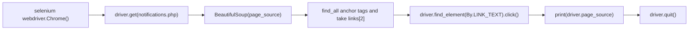

# startingwbd — first try at web scraping the IMS NSIT notice board

A single script, `ims wbscrap try bs4+selenium.py`, that opens the NSIT student portal notifications page (`https://www.imsnsit.org/imsnsit/notifications.php`) in a Selenium-driven Chrome window, parses the page with BeautifulSoup, clicks the third link on the page and prints the HTML of the page that opens.

## How it works



## Getting started

```bash
pip install requests beautifulsoup4 selenium
python "ims wbscrap try bs4+selenium.py"
```

Needs Google Chrome and a matching ChromeDriver on `PATH` (Selenium 4.6+ downloads one automatically).

## Status and limitations

- Experiment only: `requests` is imported but unused, an `ironpdf` import is commented out, and the link is chosen by index (`links[2]`), so it breaks if the page layout changes.
- `find_element(By.LINK_TEXT, link)` is passed the link's `href`, not its visible text, so the click will not find the element on most pages.
- No tests.

## License

MIT — see `LICENSE`.
